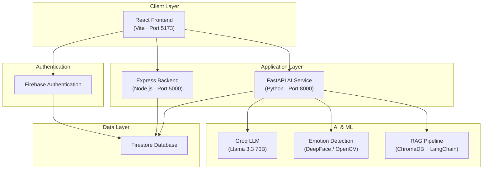

# Momentum

**Momentum is an AI-powered student productivity platform that combines intelligent task management, AI mentoring, emotion-aware assistance, analytics, and academic planning into one unified platform.**

[Live Demo](https://momentum01.netlify.app)
[React](https://react.dev/)
[Vite](https://vitejs.dev/)
[Express](https://expressjs.com/)
[FastAPI](https://fastapi.tiangolo.com/)
[Firebase](https://firebase.google.com/)
[Groq](https://groq.com/)
[JavaScript](https://developer.mozilla.org/en-US/docs/Web/JavaScript)
[Python](https://www.python.org/)
[License: MIT](LICENSE)
[Netlify](https://momentum01.netlify.app)

---


## Live Demo

**[https://momentum01.netlify.app](https://momentum01.netlify.app)**

The frontend is deployed on Netlify. Open the link above to explore the full student and college admin experience.

> **Note:** AI Mentor, emotion detection, and stress analysis require the FastAPI AI service and Express backend to be running locally or deployed separately. The deployed frontend connects to Firebase for authentication and core data features.

---


## Project Overview


### Problem Statement

Students juggle coursework, deadlines, wellness, and productivity across fragmented tools — task apps, calendars, chatbots, and mental health resources rarely work together. Academic institutions lack unified visibility into student engagement and well-being.

### Why Momentum Was Built

Momentum was designed to unify productivity, AI-assisted learning, wellness monitoring, and institutional oversight into a single platform. Instead of switching between five different apps, students get one dashboard that adapts to their academic rhythm and emotional state.

### Target Users


| User                       | Role                                                                                                          |
| -------------------------- | ------------------------------------------------------------------------------------------------------------- |
| **Students**               | Manage tasks, track habits, use AI mentoring, monitor emotions, book counselors, and view analytics           |
| **College Administrators** | Monitor student analytics, review tasks, manage departments, moderate support channels, and view leaderboards |


### Objectives

- Provide an all-in-one student productivity hub with real-time analytics
- Deliver context-aware AI mentoring powered by retrieval-augmented generation (RAG)
- Support emotion-aware wellness features for proactive academic support
- Enable role-based dashboards for students and college administrators
- Integrate Firebase for secure authentication and scalable data storage


### Real-World Impact

Momentum addresses the gap between academic productivity tools and student wellness by connecting study behavior, emotional state, and AI guidance in one platform — giving both students and institutions actionable insight rather than isolated data points.

---


## Key Features


### Student Experience


| Feature                       | Description                                                                           |
| ----------------------------- | ------------------------------------------------------------------------------------- |
| **Student Dashboard**         | Central hub with study stats, momentum score, task overview, and quick actions        |
| **Smart Task Management**     | Personal and collaborative tasks with verification, assignment, and progress tracking |
| **AI Mentor**                 | RAG-powered chatbot using Groq LLM and document knowledge base for academic guidance  |
| **Emotion Detection**         | Real-time facial emotion analysis via webcam for wellness awareness                   |
| **Calendar Integration**      | Full calendar with Google Sync, drag-and-drop events, and task linking                |
| **Productivity Analytics**    | Study time, focus scores, distraction tracking, and weekly trend charts               |
| **Smart Study Reels**         | AI-curated short-form study content recommendations via YouTube integration           |
| **Habit Tracker**             | Daily habit logging with streak tracking and visual progress                          |
| **Mood Tracker**              | Manual mood logging with historical trends                                            |
| **Leaderboard**               | Gamified momentum score rankings across students                                      |
| **Anonymous Student Support** | Moderated peer support rooms with real-time chat                                      |
| **Counselor Booking**         | Browse counselors, book sessions, and access emergency support                        |
| **Focus Room**                | Distraction-free study environment with ambient sounds                                |
| **Progress Tracking**         | Momentum score engine combining study time, productivity, and wellness data           |


### Platform & Admin


| Feature                        | Description                                                       |
| ------------------------------ | ----------------------------------------------------------------- |
| **Firebase Authentication**    | Email/password, Google, and GitHub sign-in with role-based access |
| **College Admin Dashboard**    | Institution-wide analytics, student monitoring, and reporting     |
| **Stress Monitoring**          | Admin view of student wellness and stress indicators              |
| **Support Moderation**         | Review and moderate anonymous support room messages               |
| **Department Management**      | Organize students and admins by academic department               |
| **AI-Powered Recommendations** | Personalized study content and focus suggestions                  |
| **Responsive Design**          | Mobile-friendly layouts across all student and admin views        |


---


## Architecture

Momentum follows a three-tier architecture with Firebase as the shared data layer and Groq powering AI inference.




### Layer Responsibilities


| Layer                       | Technology                       | Responsibility                                                                |
| --------------------------- | -------------------------------- | ----------------------------------------------------------------------------- |
| **React Frontend**          | React 19, Vite, Tailwind CSS     | UI rendering, routing, client-side state, Firebase client SDK                 |
| **Firebase Authentication** | Firebase Auth                    | User sign-up, sign-in, OAuth, session management, role claims                 |
| **Express Backend**         | Node.js, Express, Firebase Admin | Extension analytics, emotion session persistence, admin API, momentum scoring |
| **FastAPI AI Service**      | Python, FastAPI, Uvicorn         | AI Mentor chat, emotion detection, stress analysis, RAG retrieval             |
| **Groq AI**                 | Llama 3.3 70B Versatile          | LLM inference for mentoring and content generation                            |
| **Emotion Detection**       | DeepFace, OpenCV, TensorFlow     | Real-time facial emotion classification from webcam frames                    |
| **Firestore**               | Firebase Firestore               | Users, tasks, habits, moods, emotions, leaderboard, support rooms             |


For detailed architecture documentation, see [docs/README_ARCHITECTURE.md](docs/README_ARCHITECTURE.md).

---


## Technology Stack


| Category              | Technologies                                                                                  |
| --------------------- | --------------------------------------------------------------------------------------------- |
| **Frontend**          | React 19, Vite 6, Tailwind CSS 3, Framer Motion, Recharts, React Router 7, React Big Calendar |
| **Backend**           | Node.js, Express 5, Firebase Admin SDK, CORS                                                  |
| **AI / ML**           | Python, FastAPI, Uvicorn, LangChain, Groq, ChromaDB, DeepFace, OpenCV, Sentence Transformers  |
| **Database**          | Firebase Firestore (NoSQL, real-time)                                                         |
| **Authentication**    | Firebase Auth (Email, Google OAuth, GitHub OAuth)                                             |
| **Hosting**           | Netlify (frontend production deployment)                                                      |
| **Development Tools** | ESLint, PostCSS, npm, pip, GitHub Actions CI                                                  |


---


## Screenshots

> Screenshots coming soon. Add PNG files to `[screenshots/](screenshots/)` and update this section.


| Landing Page | Login     | Student Dashboard |
| ------------ | --------- | ----------------- |
| *pending*    | *pending* | *pending*         |


| Calendar  | Analytics | AI Mentor |
| --------- | --------- | --------- |
| *pending* | *pending* | *pending* |


| Emotion Detection | College Dashboard | Mobile View |
| ----------------- | ----------------- | ----------- |
| *pending*         | *pending*         | *pending*   |


See [screenshots/README.md](screenshots/README.md) for the required file list and capture guidelines.

---


## Folder Structure

```
Momentum/
├── frontend/                       # React + Vite application
│   ├── src/
│   │   ├── components/             # UI components (student, college, auth, calendar)
│   │   ├── contexts/               # React context providers (AuthContext)
│   │   ├── pages/                  # Page-level route components
│   │   ├── services/               # API and Firebase service modules
│   │   ├── utils/                  # Utility functions
│   │   ├── App.jsx                 # Root router and route definitions
│   │   ├── firebase.js             # Firebase client initialization
│   │   └── main.jsx                # Application entry point
│   ├── public/                     # Static assets (icons, sounds, images)
│   ├── package.json
│   ├── vite.config.js
│   ├── tailwind.config.js
│   └── .env.example
│
├── backend/
│   ├── server/                     # Express API (port 5000)
│   │   ├── server.js               # API routes and Firebase Admin logic
│   │   ├── package.json
│   │   ├── serviceAccountKey.json.example  # Template (safe to commit)
│   │   └── serviceAccountKey.json          # Local credentials (gitignored)
│   │
│   └── ai-service/                 # FastAPI AI service (port 8000)
│       ├── chatbot_api.py          # Main AI API (DeepFace emotion detection)
│       ├── chatbot_api_alternative.py  # Lightweight FER alternative
│       ├── emotion_detection.py    # Emotion detection helpers
│       ├── requirements.txt
│       └── .env.example
│
├── docs/                           # Extended documentation
├── screenshots/                    # Application screenshots for README
├── scripts/                        # Windows/macOS helper startup scripts
├── .github/                        # Issue templates, PR template, CI workflow
├── README.md
├── LICENSE
├── CONTRIBUTING.md
├── SECURITY.md
└── CODE_OF_CONDUCT.md
```

---


## Installation


### Prerequisites

- **Node.js** 18 or later
- **npm**
- **Python** 3.8 or later
- **pip**
- A **Firebase** project with Authentication and Firestore enabled
- A **Groq API key** for AI features


### 1. Clone the Repository

```bash
git clone https://github.com/YOUR_USERNAME/Momentum.git
cd Momentum
```


### 2. Frontend Setup

```bash
cd frontend
npm install
cp .env.example .env
# Edit .env with your Firebase and API keys
```


### 3. Backend Setup

```bash
cd ../backend/server
npm install
cp serviceAccountKey.json.example serviceAccountKey.json
# Edit serviceAccountKey.json with Firebase Admin credentials (never commit it)
```


### 4. AI Service Setup

```bash
cd ../ai-service
python -m venv venv

# Windows
venv\Scripts\activate

# macOS / Linux
source venv/bin/activate

pip install -r requirements.txt
cp .env.example .env
# Edit .env and add your GROQ_API_KEY
```

---


## Environment Variables

All secrets are managed through environment variables. **Never commit** `.env` **files or credential JSON files.**

### Frontend — `frontend/.env`

Copy from `[frontend/.env.example](frontend/.env.example)`:


| Variable                            | Required | Description                            |
| ----------------------------------- | -------- | -------------------------------------- |
| `VITE_FIREBASE_API_KEY`             | Yes      | Firebase web API key                   |
| `VITE_FIREBASE_AUTH_DOMAIN`         | Yes      | Firebase auth domain                   |
| `VITE_FIREBASE_PROJECT_ID`          | Yes      | Firebase project ID                    |
| `VITE_FIREBASE_STORAGE_BUCKET`      | Yes      | Firebase storage bucket                |
| `VITE_FIREBASE_MESSAGING_SENDER_ID` | Yes      | Firebase messaging sender ID           |
| `VITE_FIREBASE_APP_ID`              | Yes      | Firebase app ID                        |
| `VITE_GROQ_API_KEY`                 | Yes      | Groq API key (client-side AI features) |
| `VITE_GEMINI_API_KEY`               | Optional | Gemini API key (fallback AI)           |
| `VITE_YOUTUBE_API_KEY`              | Optional | YouTube Data API (Study Reels)         |
| `VITE_GITHUB_TOKEN`                 | Optional | GitHub API token                       |
| `VITE_GOOGLE_CLIENT_ID`             | Optional | Google Calendar OAuth                  |


### AI Service — `backend/ai-service/.env`

Copy from `[backend/ai-service/.env.example](backend/ai-service/.env.example)`:


| Variable       | Required | Description                    |
| -------------- | -------- | ------------------------------ |
| `GROQ_API_KEY` | Yes      | Groq API key for LLM inference |


### Backend Server — `backend/server/`


| File                     | Required | Description                                               |
| ------------------------ | -------- | --------------------------------------------------------- |
| `serviceAccountKey.json` | Yes      | Copy from `serviceAccountKey.json.example` — never commit |
| `PORT`                   | Optional | Server port (default: `5000`)                             |


---


## Running the Project

Three services must run simultaneously for the full experience.

### Terminal 1 — Frontend (port 5173)

```bash
cd frontend
npm run dev
```

Open [http://localhost:5173](http://localhost:5173)

### Terminal 2 — Express Backend (port 5000)

```bash
cd backend/server
npm start
```


### Terminal 3 — FastAPI AI Service (port 8000)

```bash
cd backend/ai-service
venv\Scripts\activate        # Windows
# source venv/bin/activate   # macOS / Linux
python chatbot_api.py
```

Interactive API docs: [http://127.0.0.1:8000/docs](http://127.0.0.1:8000/docs)

### Helper Scripts (Windows)

```bash
scripts\check_services.bat
scripts\START_AI_SERVICE_NOW.bat
scripts\start_emotion_detection.bat
```


### Verify All Services

```bash
curl http://localhost:5173/
curl http://localhost:5000/
curl http://127.0.0.1:8000/health
```

---


## Deployment


### Frontend — Netlify (Production)

The frontend is deployed at **[https://momentum01.netlify.app](https://momentum01.netlify.app)**.

Recommended Netlify setup:

1. Connect the GitHub repository to Netlify
2. Set **Base directory** to `frontend`
3. Set **Build command** to `npm run build`
4. Set **Publish directory** to `frontend/dist`
5. Add environment variables from `frontend/.env.example` in the Netlify dashboard


### Backend — Express (Recommended)

Deploy to Railway, Render, or a VPS:

```bash
cd backend/server
npm install --production
PORT=5000 node server.js
```

Set `serviceAccountKey.json` contents as an environment variable or mount as a secret file.

### AI Service — FastAPI (Recommended)

Deploy to Railway, Render, or a GPU-enabled VPS:

```bash
cd backend/ai-service
pip install -r requirements.txt
uvicorn chatbot_api:app --host 0.0.0.0 --port 8000
```

Set `GROQ_API_KEY` in the deployment environment.

For detailed deployment guides, see [docs/README_DEPLOYMENT.md](docs/README_DEPLOYMENT.md).

---


## Future Improvements


| Area                   | Planned Enhancement                                            |
| ---------------------- | -------------------------------------------------------------- |
| **Containerization**   | Docker Compose for one-command local and production setup      |
| **Caching**            | Redis for session caching and leaderboard performance          |
| **AI Personalization** | User-specific learning profiles and adaptive mentoring         |
| **Mobile App**         | React Native companion app for on-the-go productivity          |
| **LMS Integration**    | Moodle, Canvas, and Google Classroom connectors                |
| **Notifications**      | Push notifications for deadlines, habits, and wellness alerts  |
| **Cloud Deployment**   | Full AWS / GCP deployment with auto-scaling AI service         |
| **Role-Based Access**  | Granular permissions for faculty, counselors, and admins       |
| **Study Groups**       | Collaborative study rooms with shared tasks and focus sessions |


---


## Security

Momentum implements multiple layers of security:

- **Firebase Authentication** — Industry-standard auth with OAuth providers and secure session tokens
- **Environment Variables** — All API keys and credentials loaded from `.env` files, never hardcoded
- **Protected Routes** — Role-based route guards (`student`, `college_admin`) on all dashboard pages
- **Secure API Key Management** — Frontend keys use `VITE_` prefix; server keys stay server-side
- **No Credentials in Repository** — `.gitignore` excludes `.env`, `serviceAccountKey.json`, and credential files

See [SECURITY.md](SECURITY.md) for the full security policy and vulnerability reporting process.

---


## Documentation


| Document                                    | Description                                              |
| ------------------------------------------- | -------------------------------------------------------- |
| [Architecture](docs/README_ARCHITECTURE.md) | System design, data flow, and component responsibilities |
| [Database](docs/README_DATABASE.md)         | Firestore collections, indexes, and security rules       |
| [API Reference](docs/README_API.md)         | Express and FastAPI endpoint documentation               |
| [AI Service](docs/README_AI.md)             | RAG pipeline, emotion detection, and Groq integration    |
| [Deployment](docs/README_DEPLOYMENT.md)     | Production deployment guides                             |
| [Contributing](CONTRIBUTING.md)             | Development setup and contribution guidelines            |
| [Security](SECURITY.md)                     | Security policy and responsible disclosure               |


---


## Contributors

Contributions are welcome. See [CONTRIBUTING.md](CONTRIBUTING.md) for setup instructions and coding standards.

---


## License

This project is licensed under the [MIT License](LICENSE).

---


## Acknowledgements

- [React](https://react.dev/) — UI framework
- [Firebase](https://firebase.google.com/) — Authentication and database
- [FastAPI](https://fastapi.tiangolo.com/) — AI service framework
- [Groq](https://groq.com/) — High-performance LLM inference
- [LangChain](https://langchain.com/) — RAG and LLM orchestration
- [Netlify](https://www.netlify.com/) — Frontend hosting
- The open-source community for the libraries and tools that made this project possible

---


## Contact


|               |                                                                                        |
| ------------- | -------------------------------------------------------------------------------------- |
| **LinkedIn**  | [https://www.linkedin.com/in/yashmhasekar/](https://linkedin.com/in/YOUR_LINKEDIN)    |
| **Email**     | [yashmhasekar.hackathons@gmail.com](mailto:YOUR_EMAIL@example.com)                     |
| **Portfolio** | [coming](https://YOUR_PORTFOLIO.com) soon                                              |
| **GitHub**    | [https://github.com/YashMhasekar/Momentum](https://github.com/YOUR_USERNAME/Momentum) |


