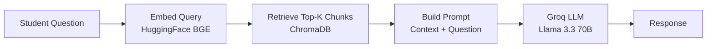

# AI Service

The Momentum AI service (`backend/ai-service/`) provides intelligent mentoring, real-time emotion detection, and wellness analysis powered by Groq LLM and computer vision.

---

## Overview

| Property | Value |
|----------|-------|
| Framework | FastAPI + Uvicorn |
| Port | 8000 |
| LLM Provider | Groq (Llama 3.3 70B Versatile) |
| Vector DB | ChromaDB |
| Embeddings | HuggingFace BGE (`all-MiniLM-L6-v2`) |
| Emotion Model | DeepFace (primary) / FER (alternative) |
| Entry Point | `chatbot_api.py` |

---

## Capabilities

### 1. AI Mentor (RAG Chatbot)

A retrieval-augmented generation chatbot that answers student questions using a knowledge base of PDF documents.

**Pipeline:**



**Configuration:**

- Model: `llama-3.3-70b-versatile`
- Temperature: `0` (deterministic)
- Chunk size: 500 tokens, 50 token overlap
- Vector store path: `./chroma_db`

**Knowledge base:** Place PDF files in `backend/ai-service/data/`. They are loaded and embedded on service startup.

<!-- TODO: Document data/ folder contents and how to add new documents -->

---

### 2. Emotion Detection

Real-time facial emotion analysis from webcam frames sent by the frontend.

**Primary backend (`chatbot_api.py`):**

- Library: DeepFace + OpenCV + TensorFlow
- Input: Base64-encoded JPEG frame
- Output: Dominant emotion + confidence scores for all detected emotions
- Supported emotions: happy, sad, angry, fear, surprise, disgust, neutral

**Alternative backend (`chatbot_api_alternative.py`):**

- Library: FER (Facial Expression Recognition)
- Use when TensorFlow/DeepFace fails to install
- Lighter weight, no TensorFlow dependency
- Run via `scripts/start_emotion_detection.bat` option 2

---

### 3. Stress Analysis

Analyzes combined emotion, study, and mood data to produce wellness scores and recommendations.

**Input:** Emotion session history, study hours, sleep data, mood entries

**Output:**

- Stress level classification
- Wellness score (0–100)
- Personalized recommendations (study tips, break suggestions, wellness actions)

---

## Setup

### Prerequisites

- Python 3.8+
- Groq API key ([console.groq.com](https://console.groq.com))
- Visual C++ Redistributable (Windows, for TensorFlow/DeepFace)

### Installation

```bash
cd backend/ai-service

# Create virtual environment
python -m venv venv

# Activate
venv\Scripts\activate        # Windows
source venv/bin/activate   # macOS / Linux

# Install dependencies (5–15 minutes)
pip install -r requirements.txt

# Configure environment
cp .env.example .env
# Add GROQ_API_KEY=your_key_here
```

### Running

```bash
python chatbot_api.py
```

Expected startup output:

```
==================================================
🤖 AI Mentor Backend Starting...
==================================================
📍 Server: http://127.0.0.1:8000
📚 Docs: http://127.0.0.1:8000/docs
🔥 Status: Ready to help students!
==================================================
```

### Verify

```bash
curl http://127.0.0.1:8000/health
# {"status":"healthy","database":"connected","llm":"connected"}

python test_service.py
```

---

## Dependencies

Key packages from `requirements.txt`:

| Package | Purpose |
|---------|---------|
| `fastapi` | Web framework |
| `uvicorn` | ASGI server |
| `langchain` | LLM orchestration |
| `langchain-groq` | Groq LLM integration |
| `langchain-community` | Document loaders, embeddings |
| `chromadb` | Vector database |
| `sentence-transformers` | Text embeddings |
| `pypdf` | PDF document loading |
| `opencv-python` | Image processing |
| `deepface` | Facial emotion analysis |
| `tensorflow` | Deep learning backend for DeepFace |
| `python-dotenv` | Environment variable loading |

---

## API Endpoints

| Method | Path | Description |
|--------|------|-------------|
| `GET` | `/` | Service info |
| `GET` | `/health` | Health check |
| `POST` | `/chat` | AI Mentor chat |
| `POST` | `/detect-emotion` | Single-frame emotion detection |
| `POST` | `/analyze-emotion-session` | Session wellness analysis |
| `POST` | `/analyze-stress` | Stress level analysis |

Full request/response schemas: [README_API.md](README_API.md)

Interactive Swagger UI: `http://127.0.0.1:8000/docs`

---

## Environment Variables

| Variable | Required | Description |
|----------|----------|-------------|
| `GROQ_API_KEY` | Yes | Groq API key for LLM inference |

Copy from [`backend/ai-service/.env.example`](../backend/ai-service/.env.example).

---

## Troubleshooting

| Issue | Solution |
|-------|----------|
| CORS error from frontend | Ensure AI service is running on port 8000 |
| `ModuleNotFoundError` | Run `pip install -r requirements.txt` |
| TensorFlow fails on Windows | Install [VC++ Redistributable](https://aka.ms/vs/17/release/vc_redist.x64.exe) or use FER alternative |
| Port 8000 in use | `netstat -ano \| findstr :8000` then kill the process |
| ChromaDB empty responses | Add PDF files to `data/` folder and restart |
| Slow first request | ChromaDB and embedding model load on startup — wait for ready message |

---

## Production Considerations

<!-- TODO: Document production deployment specifics -->

| Concern | Recommendation |
|---------|---------------|
| **Model loading** | Pre-warm ChromaDB and embeddings on startup |
| **GPU** | Optional GPU instance for faster DeepFace inference |
| **Scaling** | Run multiple Uvicorn workers behind a load balancer |
| **CORS** | Restrict `allow_origins` to production frontend domain |
| **Rate limiting** | Add rate limiting on `/chat` to control Groq API costs |
| **Monitoring** | Monitor `/health` endpoint; alert on LLM connectivity failures |
| **Secrets** | Inject `GROQ_API_KEY` via deployment platform secrets |

---

## Future AI Enhancements

<!-- TODO: Track planned AI improvements -->

- [ ] User-specific conversation memory
- [ ] Fine-tuned domain models for academic subjects
- [ ] Multi-modal input (voice, document upload)
- [ ] Personalized study plan generation
- [ ] Federated emotion model for privacy
- [ ] Streaming chat responses (SSE)

---

## Related Documentation

- [API Reference](README_API.md)
- [Architecture](README_ARCHITECTURE.md)
- [Deployment](README_DEPLOYMENT.md)
