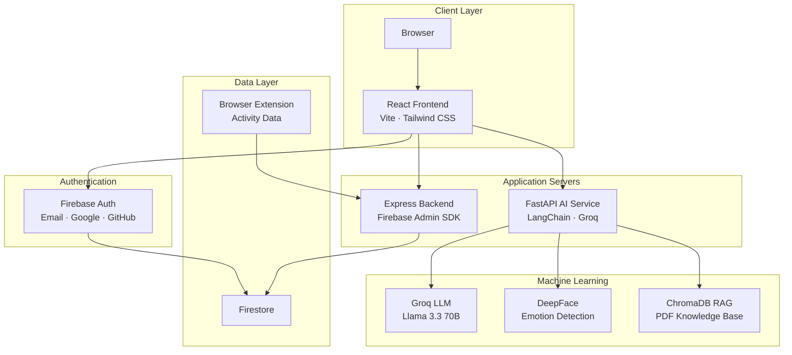
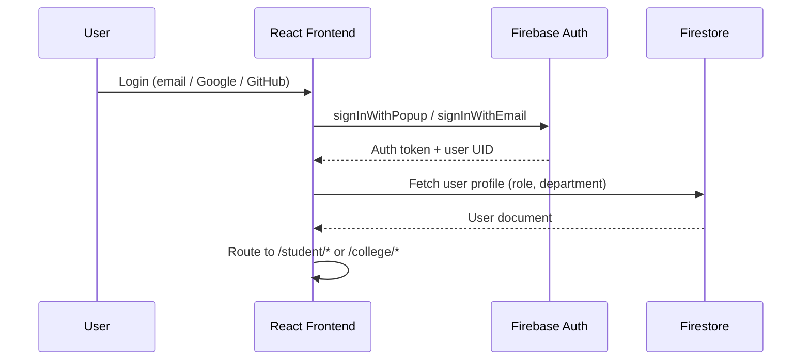
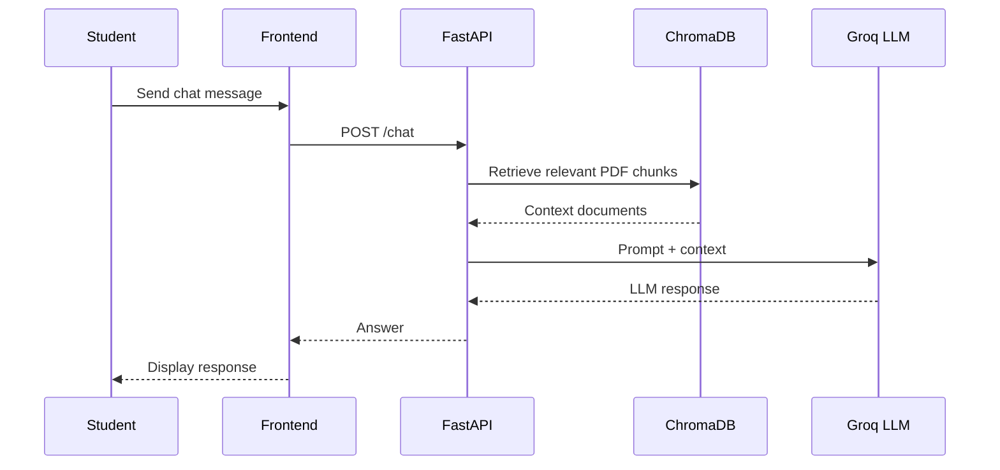
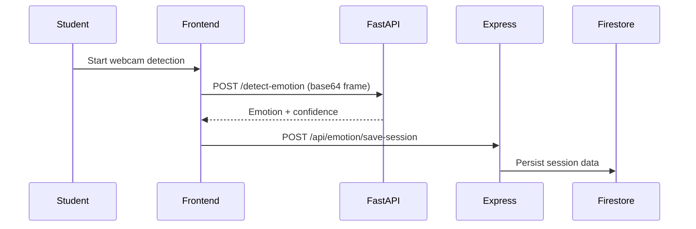

# Architecture

This document describes the system architecture of Momentum — a three-tier, AI-powered student productivity platform.

---

## Overview

Momentum is composed of four primary layers:

| Layer | Technology | Port | Role |
|-------|-----------|------|------|
| Client | React 19 + Vite 6 | 5173 | User interface and client-side logic |
| API Server | Node.js + Express 5 | 5000 | Analytics, emotion persistence, admin operations |
| AI Service | Python + FastAPI | 8000 | LLM chat, emotion detection, stress analysis |
| Data | Firebase Firestore | — | Persistent storage and real-time sync |

---

## System Diagram

---

## Component Responsibilities

### React Frontend (`frontend/`)

- Renders all student and college admin UI
- Manages client-side routing via React Router 7
- Authenticates users through Firebase Auth SDK
- Reads and writes Firestore data directly for real-time features (tasks, habits, moods)
- Calls Express backend for extension analytics and emotion session persistence
- Calls FastAPI service for AI Mentor chat, emotion detection, and stress analysis
- Enforces role-based route protection via `ProtectedRoute` and `AuthContext`

**Key modules:**

| Module | Path | Purpose |
|--------|------|---------|
| Router | `src/App.jsx` | Route definitions for student and college admin |
| Auth | `src/contexts/AuthContext.jsx` | Session state, role management |
| Firebase | `src/firebase.js` | Firebase client initialization |
| Services | `src/services/` | API calls and business logic |

### Express Backend (`backend/server/`)

- Handles browser extension analytics ingestion
- Calculates productivity ratios and momentum score contributions
- Persists emotion detection session data to Firestore
- Serves admin analytics aggregation endpoints
- Uses Firebase Admin SDK for privileged Firestore operations

**Why a separate backend?**

Some operations require server-side Firebase Admin privileges (writing cross-user analytics, admin dashboards) that cannot be performed safely from the client SDK alone.

### FastAPI AI Service (`backend/ai-service/`)

- **AI Mentor** — RAG pipeline: PDF documents → ChromaDB embeddings → Groq LLM responses
- **Emotion Detection** — Webcam frame analysis via DeepFace/OpenCV
- **Stress Analysis** — Wellness scoring from emotion session data
- **Health checks** — Service status endpoint for monitoring

**Alternative backend:** `chatbot_api_alternative.py` uses the lightweight FER library instead of TensorFlow/DeepFace for systems where TensorFlow is unavailable.

---

## Data Flow

### Authentication Flow

### AI Mentor Flow

### Emotion Detection Flow

---

## Authentication & Authorization

### Providers

- Email / password
- Google OAuth (with Calendar scopes)
- GitHub OAuth

### Roles

| Role | Route Prefix | Access |
|------|-------------|--------|
| `student` | `/student/*` | Student dashboard and all student features |
| `college_admin` | `/college/*` | Admin analytics, moderation, department management |

Role is stored in the Firestore user document and checked by `ProtectedRoute` on every navigation.

<!-- TODO: Document custom claims setup if implemented -->

---

## External Services

| Service | Used For | Configuration |
|---------|----------|---------------|
| Firebase Auth | User authentication | `frontend/.env` (`VITE_FIREBASE_*`) |
| Firestore | Primary database | Firebase Console |
| Groq | LLM inference | `backend/ai-service/.env` |
| Gemini | Fallback AI generation | `frontend/.env` (`VITE_GEMINI_API_KEY`) |
| YouTube Data API | Smart Study Reels | `frontend/.env` (`VITE_YOUTUBE_API_KEY`) |
| Google Calendar | Calendar sync | `frontend/.env` (`VITE_GOOGLE_CLIENT_ID`) |
| GitHub API | Profile integration | `frontend/.env` (`VITE_GITHUB_TOKEN`) |
| Netlify | Frontend hosting | Netlify dashboard |

---

## Scalability Considerations

<!-- TODO: Document horizontal scaling strategy for each service -->

| Component | Current State | Future Direction |
|-----------|--------------|-----------------|
| Frontend | Static SPA on Netlify CDN | Edge functions for SSR if needed |
| Express | Single Node process | PM2 cluster or container replicas |
| FastAPI | Single Uvicorn worker | Gunicorn + multiple workers, GPU instance for ML |
| Firestore | Managed NoSQL | Composite indexes, read replicas via caching |
| ChromaDB | Local file-based | Managed vector DB (Pinecone, Weaviate) |

---

## Related Documentation

- [Database Schema](README_DATABASE.md)
- [API Reference](README_API.md)
- [AI Service Details](README_AI.md)
- [Deployment Guide](README_DEPLOYMENT.md)
